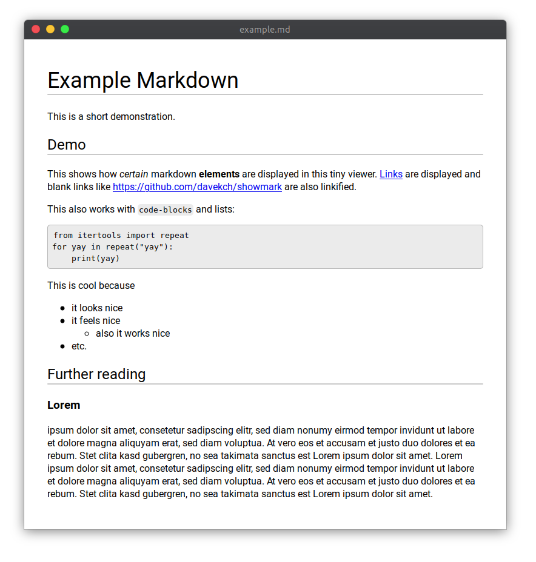

# showmark
A simple markdown viewer




## Features
 - basic markdown like titles, bold, italic, monospace ✔️
 - clickable links ✔️
 - code blocks between three backticks ✔️
 - nested lists ✔️
 - updates on file change ✔️

## Usage

```
python showmark.py path/to/file.md
```

## Installation

requires python3.6 or newer
```
pip install pywebview[qt] markdown fire watchdog mdx_linkify mdx_truly_sane_lists
```
